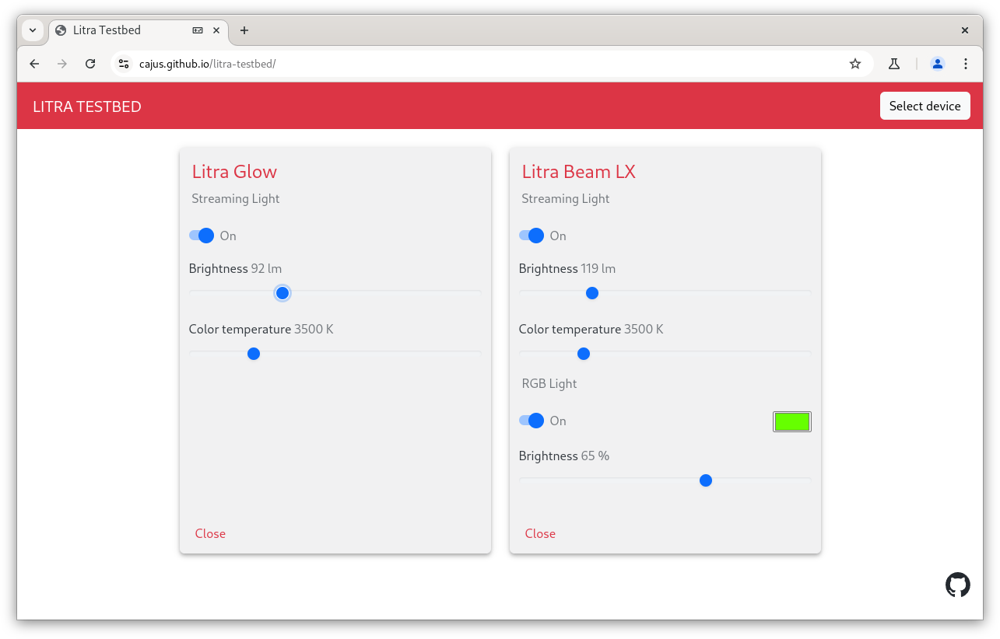

# Litra Testbed

Have a Litra device? Try it [live](https://cajus.github.io/litra-testbed/) in your Chrome enabled browser.



In order to integrate a possibility to control my Logitech Litra from our video telephony software, I had to
learn what to send the device via USB. Browsing thru github, there were a couple of projects that achieve
that by sending 20 bytes of payload.

This payload looks like that:

```
11 ff 04 1c 01 00 00 00 00 00 00 00 00 00 00 00 00 00 00 00
```

But what does it mean? Here's a brief description about what I found out.

## Protocol

After some digging around I found that Logitech has a proprietary protocol named HID++ which is used across
its devices. There is some documentation about it [here](https://github.com/Logitech/cpg-docs). This repository
also links to a [Google drive](https://drive.google.com/drive/folders/0BxbRzx7vEV7eWmgwazJ3NUFfQ28?resourcekey=0-dQ-Lx1FORQl0KAdOHQaE1A)
with more detailed information - I'm unable to link these, but I'll reference certain documents below.

### Report ID

Lets start with:

```
11
```

HID++ uses a special vendor defined usage page `0xFF43` for describing the communication channel. Here's
the excerpt of the HID report descriptor of the Litra Glow:

```
0x06, 0x43, 0xFF,  // Usage Page (Vendor Defined 0xFF43)
0x0A, 0x02, 0x02,  // Usage (0x0202)
0xA1, 0x01,        // Collection (Application)
0x85, 0x11,        //   Report ID (17)
0x75, 0x08,        //   Report Size (8)
0x95, 0x13,        //   Report Count (19)
0x15, 0x00,        //   Logical Minimum (0)
0x26, 0xFF, 0x00,  //   Logical Maximum (255)
0x09, 0x02,        //   Usage (0x02)
0x81, 0x00,        //   Input (Data,Array,Abs,No Wrap,Linear,Preferred State,No Null Position)
0x09, 0x02,        //   Usage (0x02)
0x91, 0x00,        //   Output (Data,Array,Abs,No Wrap,Linear,Preferred State,No Null Position,Non-volatile)
0xC0,              // End Collection
```

What we need to check here is the Usage (0x0202). The first byte `02` is a bitmask, which describes the supported
lengths of the reports sent to and received from the device. First bit stands for short (7 bytes), the second for
long (20 bytes) and the third for very long (64 bytes). In this case it means that the device can only deal with
"long" reports.

In the second byte of the usage, the bit marks what the following Collection is about: a definition of a long
report. If the device supports all sizes, there will be three Collections and the usages would be 0x0701 (short),
0x0702 (long) and 0x0704 (very long.

The first byte in the payload is the Report ID (17 or 0x11) of the long report. So the report is 20 bytes long
and the 0x11 is followed by 19 more bytes.

### Device ID

Lets go further:

```
11 FF
|-- Report ID (0x11)
   |-- Device ID (0xFF)
```

The second byte (0xFF) is the device index. According to the docs 0xFF is used for all wired devices, so this
will stay the same for all input and output reports.

### Features

```
11 FF 04
|-- Report ID (0x11)
   |-- Device ID (0xFF)
      | -- Feature Index (0x04)
```

The third byte is the feature index. The HID++ protocol defines various features which are defined by a two
byte Feature ID. 0x0000 is the root feature and it always has the Feature Index 0x00. Every further Feature
Index needs to be looked up. That is the reason why a Litra Glow has a 0x04 and a Litra Beam LX a 0x06 there - 
it's the same Feature, but it has a different index in these devices.

### Functions

Each feature contains a set of function and event definitions. If you take a look at the root feature
(0x000_root_v2-2.pdf of the Google Drive), you see two functions defined:

```
[0] getFeature(featId) → featureIndex, featureType, featureVersion
[1] getProtocolVersion(0, 0, pingData) → protocolNum, targetSw, pingData
```

A in depth description of the payloads is in the documents, but `getFeature` is what you need to
resolve the Feature Id to the Feature Index.

The forth byte is split into a high nibble and a low nibble. The high nibble contains the number of
the function (i.e. 0x1N for getProtocolVersion), while the low nibble contains a software ID. You can
pick whatever you want here, it's just meant to distinguish between multiple apps running in parallel.
The USB traffic people captured for their litra apps contains the software Id "C", so the resulting
code is 0x1C.

### Feature sets

Ok, now we can get the Feature Index for a Feature, but what is 0x04? To check this, we need another
feature: the Feature Set (0x0001). It implements these methods:

```
[0] getCount() → count
[1] getFeatureID(featureIndex) → featureID, featureType, featureVersion
```

To be able to call `getFeatureID()`, we first need to retrieve the Feature Index for the Feature ID
0x0001, which is done by sending

```
11 ff 00 0c 0001 <padding zeros to fill up to 20 bytes all in all>
         0c function 0, software ID C -> getFeature(16 bit featureID)
            0001 featureID
```

The response is

```
11 ff 00 0c 01 00 0000000000000000000000000000
            01 Feature Index
               00 Feature Type
```

Our desired Feature Index is 0x01. So lets call `getFeatureId(0x04)` now, to see what it is:

```
11 ff 01 1c 04 000000000000000000000000000000
      01 Feature Index 0x01 (Feature Set)
         1c function 1, software ID C -> getFeatureId(04)
```

The device replies with:

```
11 ff 01 1c 1990 00 00 000000000000000000000000
            1990 featureId -> illumination
                 00 featureType
                    00 featureVersion
```

So Feature Index 0x04 stands for Feature ID 0x1990, Version 0. You can find the corresponding PDF
in the Google drive mentioned above, and it stands for "Illumination" with the following functions:

```
[0] getIllumination() → state
[1] setIllumination(state)
[2] getBrightnessInfo()
[3] getBrightness() → brightness
[4] setBrightness(brightness)
[5] getBrightnessLevels(startIndex) → flags, targetLevels, levelValues…
[6] setBrightnessLevels(flags, targetLevels, levelValues…)
[7] getColorTemperatureInfo()
[8] getColorTemperature() → colorTemperature
[9] setColorTemperature(colorTemperature)
[10] getColorTemperatureLevels(startIndex) → flags, targetLevels, levelValues…
[11] setColorTemperatureLevels(flags, targetLevels, levelValues…)
```

and these events:

```
[0] illuminationChangeEvent → state
[1] brightnessChangeEvent → brightness
[2] colorTemperatureChangeEvent → colorTemperature
```

Going back to our initial message we wanted to decode:

```
11 ff 04 1c 01 00 00 00 00 00 00 00 00 00 00 00 00 00 00 00
11 Report ID
   ff Device Index
      04 Feature Index for Feature ID 0x1990 (Illumination)
         1c Function 1 setIllumination, Software ID C
            01 State parameter for the function -> switch on 
```

Yey, done ;-)

### Events

Events itself are like function responses, but instead of a function index, you've the event index. The index
itself is placed in the high nibble. See event handling in LitraDevice.js for more details.

### Errors

If you send an illegal request to the device, you'll receive a message that repeats your request up to the
Function ID , but it is prefaced with an additional 0xFF byte. The value following the Function/Software ID
is the error number:

```
Request  FF 09 1C 01 00 00 00 00 00 00 00 00 00 00 00 00 00 00
Response FF FF 09 1C 06 00 00 00 00 00 00 00 00 00 00 00 00 00
-> 0x06 -> Invalid feature index
```

## Sample implementation using WebHID

I've added a lazy sample implementation in raw JS. No fancy Type Script, SASS, whatever. Sorry! Feel free to
make it more robust and pretty by forking or sending a pull request ;-)
